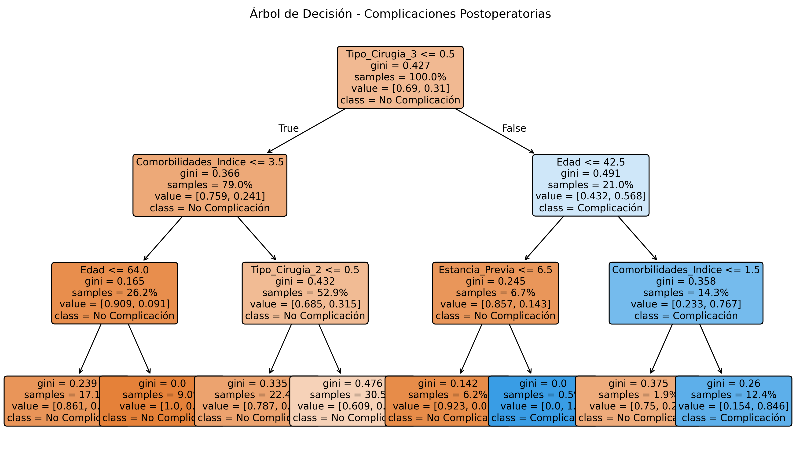
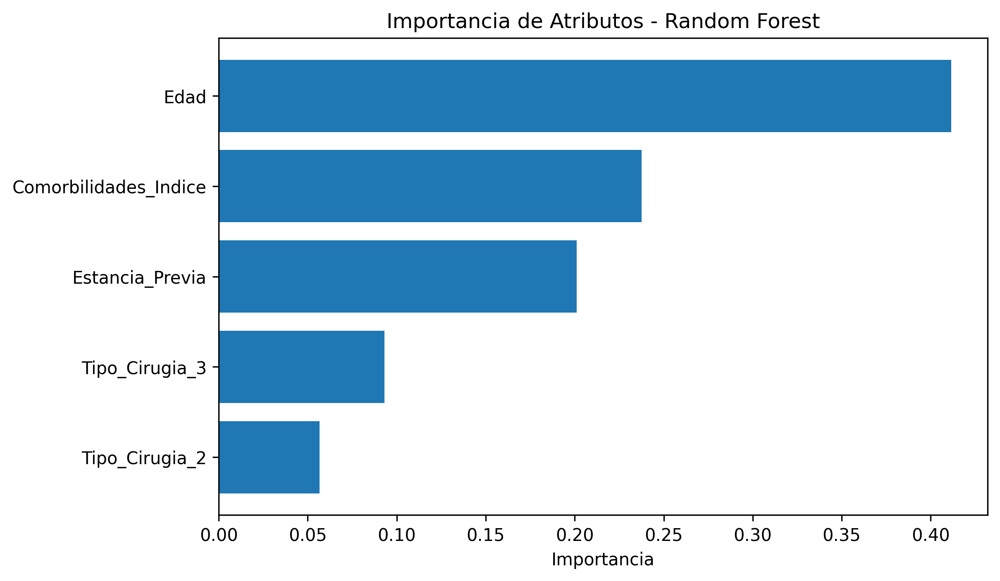

# Tarea2_taller2
Se realizará la tarea según las indicaciones

# Comparación de Modelos: Regresión Logística vs Ensamble (Random Forest)

Este proyecto simula un dataset de 300 pacientes sometidos a cirugía y compara tres enfoques predictivos:

- Árbol de Decisión (modelo no lineal y explicativo)
- Regresión Logística (modelo lineal base, Semana 1)
- Random Forest (modelo de ensamblaje, Semana 2)

El análisis incluye rendimiento predictivo (AUC), interpretabilidad e importancia de predictores.

---

## 1. Visualización del Árbol de Decisión

El árbol fue entrenado con `max_depth=3` y representa explícitamente las reglas de decisión usadas para predecir complicaciones.

---

## 2. Importancia de Atributos (Random Forest)

La importancia de variables se obtuvo del modelo de ensamblaje (Random Forest). Esto permite identificar los factores que más influyen en la predicción.

---

# 4. Reflexión Crítica y Conclusión

## **4.1. Interpretabilidad y Criterio de Separación**

En el Árbol de Decisión, la **primera división** correspondió a:

**Tipo_Cirugia_3 ≤ 0.5**  
(lo que separa cirugías mayores de cirugías no mayores).

Esto crea dos grupos con riesgos inherentemente distintos.  
A partir de esa división inicial, el árbol utiliza:

- **Comorbilidades_Indice**
- **Edad**
- **Estancia_Previa**

Por ejemplo:

- En el grupo sin cirugía mayor, la segunda división es **Comorbilidades_Indice ≤ 3.5**.
- Dentro de ese subgrupo, aparece otra partición por **Edad ≤ 64**.

Esto muestra que el impacto de la edad depende del nivel de comorbilidad y del tipo de cirugía, es decir, el modelo está capturando **interacciones entre variables** (p. ej.: *Edad × Comorbilidades*).  
En la Regresión Logística esas interacciones deben declararse explícitamente, mientras que el árbol las detecta de manera natural.

---

## **4.2. Ganancia Predictiva y el Compromiso Bias–Varianza**

AUC obtenidos en el conjunto de prueba:

- **Regresión Logística:** 0.774  
- **Árbol de Decisión:** 0.698  
- **Random Forest:** 0.680  

El mejor rendimiento se obtuvo con la **Regresión Logística**, lo que indica que la relación entre predictores y complicación puede ser capturada adecuadamente por un modelo lineal.

Interpretación:

- La **Regresión Logística** tiene más *bias* pero menor *varianza*, y generaliza bien cuando la estructura no lineal no es dominante.
- El **Random Forest** reduce varianza y captura no linealidades, pero en este dataset no aportó una mejora en discriminación.

Conclusión: En este caso, **la complejidad del ensamble no se tradujo en mayor rendimiento predictivo**, por lo que no está justificada.

---

## **4.3. Identificación de Factores de Riesgo (Random Forest)**

Ordenados por importancia:

1. **Edad** — 0.41  
2. **Comorbilidades_Indice** — 0.24  
3. **Estancia_Previa** — 0.20  
4. Tipo_Cirugia_3 — 0.09  
5. Tipo_Cirugia_2 — 0.05  

Esto concuerda con criterios clínicos: mayor edad, mayor carga de comorbilidad y mayor espera preoperatoria se asocian a mayor riesgo de complicaciones.

---

## **4.4. Conclusión Ejecutiva para el Jefe de Cirugía**

La Regresión Logística logró el mejor rendimiento (AUC = 0.774) y mantiene una excelente interpretabilidad mediante **Odds Ratios**, lo que facilita su comunicación y justificación clínica.  

El Random Forest sirve como herramienta complementaria para explorar interacciones y relevancia de variables, pero en este caso **no superó en discriminación** al modelo lineal. Por tanto, se recomienda mantener la **Regresión Logística como modelo principal**, complementada con el ensamble solo para análisis exploratorios de patrones complejos.

---
